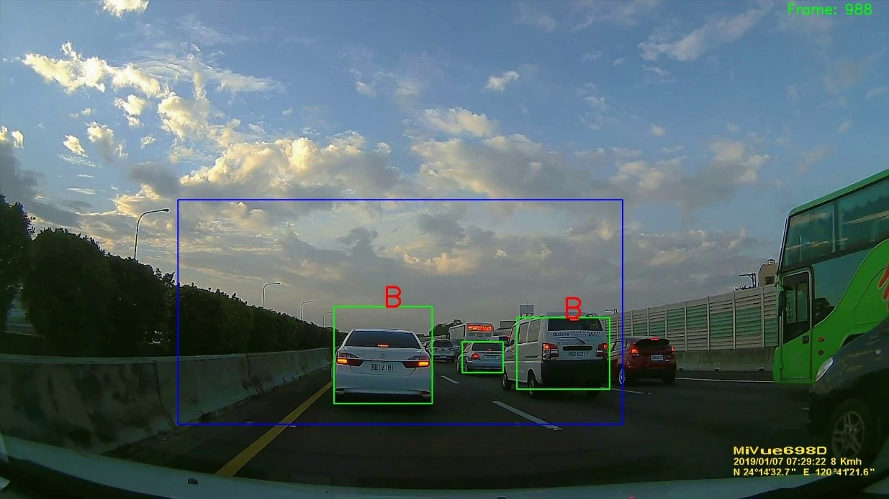

A Real-Time Forward Vehicle Detection and Signal Recognition System in All-Weather Situations
--------
**Title: 全天候即時前車偵測與信號辨識系統**

**Author: Jia-Ying Hsu**

**Date: July, 2019**

Abstract
--------
In this thesis, our system consists of six main parts: (1) Lighting condition recognition, (2) Vehicle candidate extraction, (3) Vehicle verification, (4) Vehicle tracking, (5) Taillight detection and (6) Signal recognition. Vehicle candidate is detected by vehicle characteristics in different illumination environment. In vehicle verification, we use local binary pattern as feature, training our classifier to verify the vehicle with AdaBoost algorithm. To make signal recognition stable we use object tracking algorithm to support vehicle detection. In signal recognition, we record history information of vehicle lights and use its flicking frequency as feature to train classifier, identify vehicle turning by checking whether lights are flickering or not, and then detect third light of vehicle to confirm braking.

Enviroment and dependency
--------
1. Microsoft Windows 10
2. Visual Studio 2015 Community
3. [OpenCV][1] 3.2
4. [C++ Standard Template Library][3] 
5. Train `daytime vehicle classifier`、`nighttime vehicle classifier`、`taillight flicker classifier`

Experimental equipment
--------
_title_ | _detail_
---|---
Operating system | Microsoft Windows 10
CPU | Intel Core i7-6700k @ 4.0 Ghz
RAM | 16.00 GB
Compiler | Visual Studio 2015 Community
Dashboard camera | [Mio 698][2](Image size:1920x1080)

## System Flow Chart

## Experimental Result
### daytime

### nighttime

[1]: http://opencv.org/
[2]: https://www.mio.com/tw/mivue-698
[3]: http://www.cplusplus.com/reference/stl/